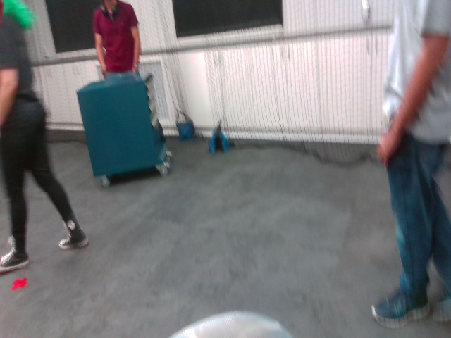
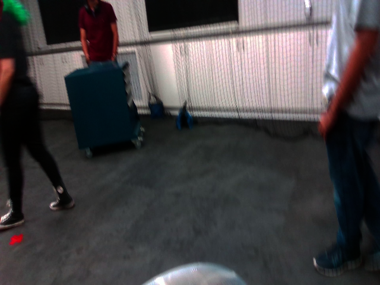
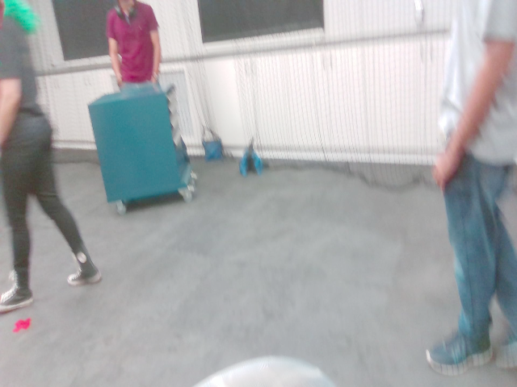
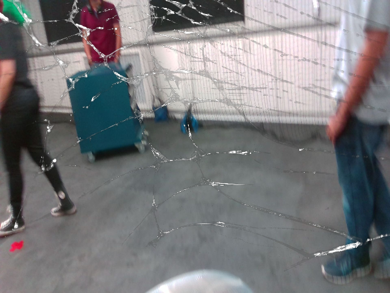
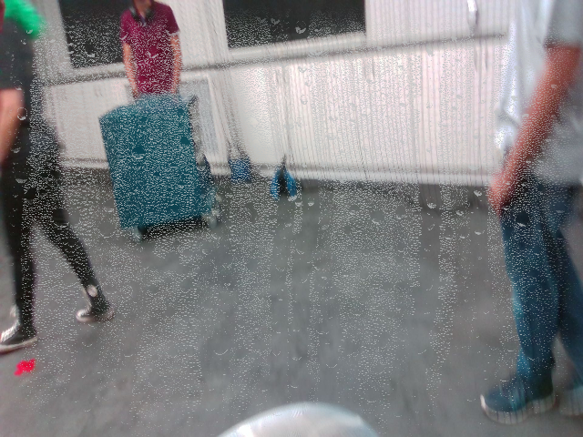
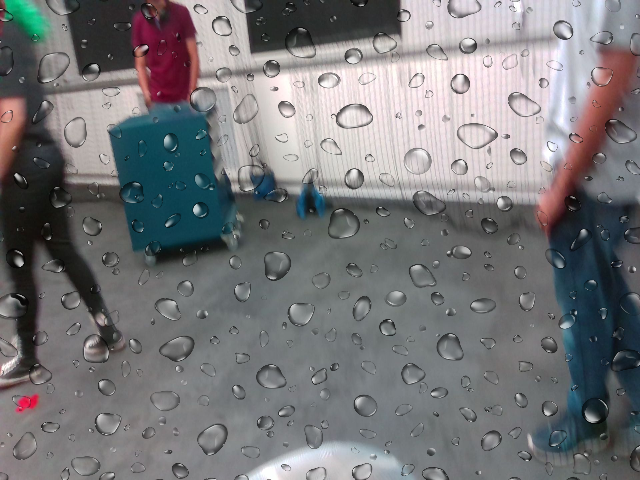
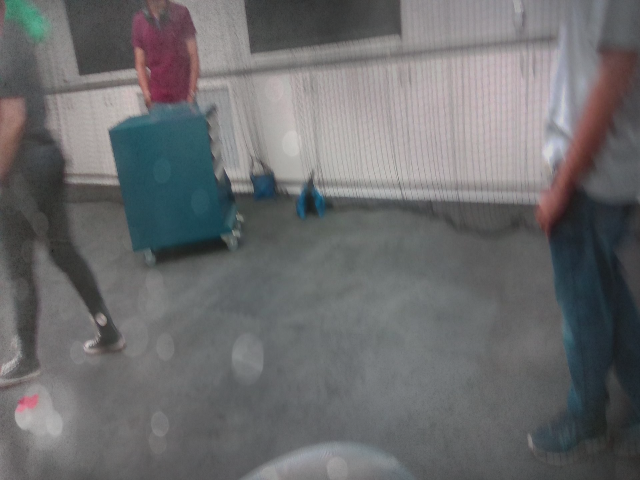

# QueensCAMP Dataset Tools

This repository contains tools for the QueensCAMP dataset. The dataset is a collection of RGB-D images of an indoor environment designed to evaluate VSLAM systems' robustness in real-world indoor environments with diverse challenges.
Below are sample images illustrating various lens failures included in the dataset that can be emulated with the provided tools:

<div class="img-grid">
  <div>
    
    <div class="caption">Original Image</div>
  </div>
  <div>
    
    <div class="caption">Underexposure</div>
  </div>
  <div>
    
    <div class="caption">Overexposure</div>
  </div>
  <div>
    
    <div class="caption">Breakage</div>
  </div>
  <div>
    
    <div class="caption">Condensation</div>
  </div>  
  <div>
    
    <div class="caption">Wet</div>
  </div>
  <div>
    
    <div class="caption">Dirt</div>
  </div>
</div>


## Scripts Usage

### 1. Download the dataset
There are 16 sequences, you can download the sequences with the failures or only the raw bags (without emulated failures):
- 01: [Full Sequence](https://drive.usercontent.google.com/download?id=1H6_Y_DupjIJNn4tnIFHsXhW0KqEeTJHm&export=download) |
               [Bag](https://drive.usercontent.google.com/download?id=1xjIQjClK1niVoXDSxSNxQe76FkAcNAff&export=download)


### 2. Rosbags Post-Processing
If you plan to download the rosbags, you can use the post-processing script to convert the rosbags to images and depth maps. The script will also generate the ground truth poses for each frame. Feel free to modify the script to suit your needs.

Usage:

```bash
python convert_bag_to_files.py <path_to_rosbag> --timestamps <path_to_save_timestamps> --trajectory_file <path_to_save_trajectory> --image_folder <path_to_save_images> --depth_folder <path_to_save_depths> --image_topic <image_topic> --depth_topic <depth_topic> --pose_topic <odom_topic>
```

For the dataset we also used the parameter `--skip 100` to skip the first 100 frames to reduce the size of static images.

### 3. Inserting Failures
The script `insert_failures.py` can be used to insert failures in the dataset images. Currently, the failures available are:
- 'underexposure'
- 'overexposure'
- 'blur'
- 'breakage'
- 'wet'
- 'condensation'
- 'dirt'

The templates for the failures are available in the `failures` folder.

Usage:

```bash
python insert_failures.py --sequence_path <path_to_sequence> --failure_type <failure_type> --output_path <path_to_save_sequence>
```

### 4. Evaluation
The script `evaluate.py` can be used to evaluate the performance of a VO/VSLAM system on the dataset. The script will compare the estimated trajectory with the ground truth trajectory and output the ATE error. The results can either be printed on the console or saved to a file.

Usage:

```bash
python evaluate.py <reference_file> <estimated_file> --output_path <path_to_save_results>
```
